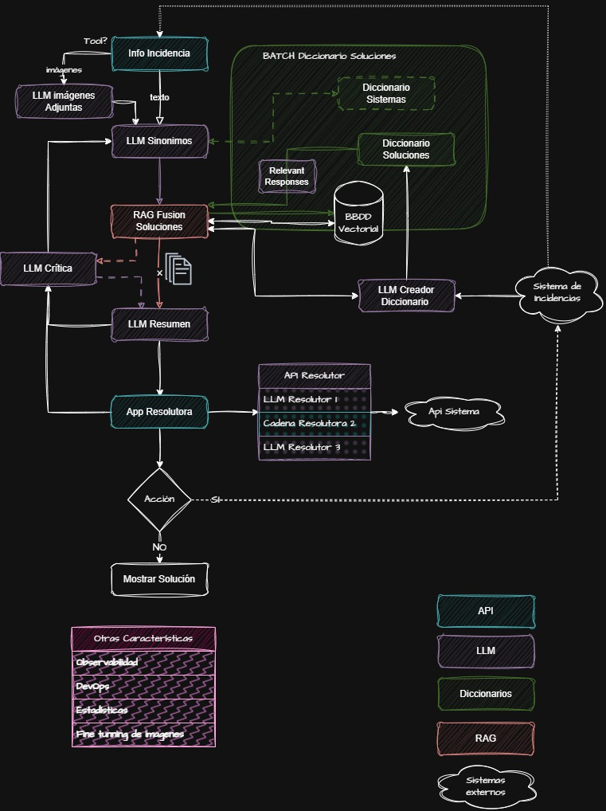

# LLM - Final
### LLM y proyecto final - Proyecto para el Bootcamp
Este proyecto es un entregable para la práctica del Master Bootcamp Inteligencia Artificial Full Stack Edición III realizado por el centro de formación [@Keepcoding](https://github.com/KeepCoding)

[](https://opensource.org/licenses/GPL-3.0)
[](https://www.python.org/downloads/)
[](https://www.typescriptlang.org/)
[](https://nodejs.org/)
[](https://docs.docker.com/compose/)
[](https://ollama.ai/)
[](https://mlflow.org/)
[](https://qdrant.tech/)
[](https://grafana.com/)
[](https://grafana.com/oss/loki/)

---

# Sistema de Gestión Automática de Incidencias con IA

Este proyecto implementa un sistema avanzado de gestión automática de incidencias utilizando técnicas de procesamiento de lenguaje natural, bases de datos vectoriales y modelos de lenguaje (LLMs). El sistema analiza incidencias de soporte técnico, las reestructura y busca soluciones similares para proporcionar resoluciones automáticas.

## Diagrama de Flujo del Sistema

El flujo del sistema se puede visualizar en el siguiente diagrama:


## Propósito del Proyecto

Este proyecto nace de la necesidad de automatizar la resolución de incidencias técnicas en un entorno empresarial. Durante el desarrollo del Master Bootcamp en Inteligencia Artificial, he explorado cómo la combinación de LLMs, bases de datos vectoriales y sistemas de validación crítica pueden transformar procesos manuales en sistemas inteligentes y autónomos.

### Objetivos Principales

- **Automatización Inteligente**: Reducir la carga de trabajo manual en la gestión de incidencias
- **Aprendizaje Continuo**: Sistema que mejora constantemente su base de conocimiento
- **Validación de Calidad**: Asegurar que las resoluciones automáticas mantengan estándares de calidad
- **Observabilidad Completa**: Proporcionar transparencia total del proceso de resolución

## Características Principales

- **Procesamiento Inteligente**: Utiliza LLMs para reestructurar y analizar incidencias
- **Base de Datos Vectorial**: Búsqueda semántica de soluciones similares usando Qdrant
- **Análisis de Imágenes**: Procesamiento de adjuntos e imágenes con modelos de visión
- **Validación Crítica**: Sistema de validación automática de resoluciones
- **Observabilidad Completa**: Logging estructurado con Loki y Grafana
- **Métricas Avanzadas**: Seguimiento detallado del rendimiento del sistema
- **Fine-tuning**: Capacidad de entrenamiento personalizado de modelos
- **Mantenimiento Automático**: Actualización automática de la base de conocimiento

## Arquitectura del Sistema

### Componentes Principales

1. **Sistema Principal** (`main.py`): Orquesta todo el proceso de resolución
2. **Base de Datos Vectorial** (Qdrant): Almacena y consulta soluciones similares
3. **Servicios Mock**: Simulan sistemas externos para desarrollo
4. **Módulos LLM**: Especializados en diferentes tareas de procesamiento
5. **Sistema de Observabilidad**: Monitoreo y métricas del sistema

### Flujo de Procesamiento

```
Incidencias → Análisis de Adjuntos → Reformulación → Búsqueda Vectorial → 
Validación Crítica → Resolución → Métricas y Logging
```

## Estructura del Proyecto

```
llm-final/
├── api/                          # APIs para servicios externos
├── core/                         # Lógica central del sistema
├── llm/                          # Módulos especializados de LLM
│   └── historico/               # Registro de entradas/salidas para fine-tuning
├── observabilidad/               # Sistema de observabilidad
├── prompts/                      # Prompts para los LLMs
├── resources/                    # Recursos del sistema
│   ├── PROBLEMAS_GLOBALES.csv   # Base de conocimiento (corazón del sistema)
│   ├── rejected/                # Log de rechazos del crítico
│   └── reportes/                # Reportes generados
├── finetune/                     # Entrenamiento personalizado
├── mock-gestor-incidencias/      # Servicio mock de incidencias
├── mock-sistema/                # Servicio mock del sistema
├── batch.py                     # Preparación de base vectorial
├── batch_mantenimiento_globales.py  # Mantenimiento automático de conocimiento
├── backup.py                    # Backup de la base vectorial
├── main.py                      # Sistema principal
└── config.py                    # Configuración centralizada
```

## Configuración y Uso

### Requisitos Previos

- Docker y Docker Compose
- Python 3.8+
- Ollama (para entorno DESA)
- MLflow (para experimentación y tracking)

### Variables de Entorno

Crear archivo `.env` con las siguientes variables:

```env
ENTORNO=DESA                    # DESA o PROD
OPENAI_API_KEY=your_api_key    # Solo para PROD
MOCK_GESTOR_URL=http://localhost:3000
MOCK_SISTEMA_URL=http://localhost:3001
VECTOR_DB_URL=http://localhost:6333
OLLAMA_BASE_URL=http://localhost:11434
```

### Instalación

1. **Clonar el repositorio**
   ```bash
   git clone <repository-url>
   cd llm-final
   ```

2. **Instalar dependencias**
   ```bash
   pip install -r requirements.txt
   ```

3. **Iniciar servicios**
   ```bash
   docker-compose up -d
   ```

4. **Iniciar MLflow**
   ```bash
   mlflow server --host 127.0.0.1 --port 5000
   ```

### Uso del Sistema

1. **Preparar base de datos vectorial**
   ```bash
   python batch.py
   ```

2. **Ejecutar sistema principal**
   ```bash
   python main.py
   ```

3. **Mantenimiento automático de conocimiento**
   ```bash
   python batch_mantenimiento_globales.py
   ```

## Funcionalidades Clave

### Base de Conocimiento Dinámica

El archivo `PROBLEMAS_GLOBALES.csv` es el corazón del sistema. Contiene el diccionario de soluciones que alimenta el sistema RAG (Retrieval-Augmented Generation). El mantenimiento continuo de este archivo es fundamental para el éxito del sistema.

### Sistema de Validación Crítica

El LLM Crítico actúa como un filtro de calidad, evaluando las resoluciones propuestas antes de su aplicación. Durante el desarrollo, descubrí que este componente era más estricto de lo esperado, pero sus comentarios resultaron ser muy valiosos para mejorar la calidad de las soluciones.

### Log de Rechazos

El directorio `resources/rejected/` almacena un registro de todas las resoluciones rechazadas por el crítico. Este log obliga al equipo a reconsiderar y mejorar las ofertas de soluciones del catálogo, contribuyendo al aprendizaje continuo del sistema.

### Histórico de LLMs

El directorio `llm/historico/` registra todas las entradas y salidas de los LLMs utilizados. Este catálogo de datos permitirá en el futuro realizar fine-tuning de modelos más ligeros sin perder calidad en las respuestas.

### Resoluciones API

El sistema soporta resoluciones tipo `api|sistema` que están diseñadas para integrar con diferentes sistemas externos. Cada tipo de resolución puede tener agentes específicos detrás para la resolución automática.

### Sistema de Backup

El módulo `backup.py` proporciona funcionalidad para crear copias de seguridad de la base de datos vectorial, asegurando la preservación del conocimiento acumulado.

## Configuración Avanzada

### Modelos de LLM

El sistema está diseñado para funcionar completamente en local, utilizando modelos más ligeros y eficientes:

- **DESA**: Gemma3 (Ollama) para procesamiento, All-MiniLM para embeddings
- **PROD**: Configuración para modelos locales optimizados

El objetivo fue demostrar que se pueden lograr resultados significativos sin depender de modelos costosos, utilizando buenos prompts y arquitectura eficiente.

### MLflow para Fine-tuning

MLflow se utiliza para registrar, comparar y revisar los procesos de fine-tuning. Desde MLflow se obtiene automáticamente la última versión de los modelos entrenados, facilitando el seguimiento de experimentos y la gestión de versiones.

### Umbrales de Configuración

```python
CRITIC_APPROVAL_THRESHOLD = 65  # % mínimo de aprobación del crítico
MAX_RETRIES_CRITIC = 2          # Reintentos para validación crítica
QUERY_LIMIT_VECTORDB = 2        # Límite de consultas vectoriales
```

## Monitoreo y Métricas

### Observabilidad

- **Loki**: Agregación de logs estructurados
- **Grafana**: Visualización de métricas y dashboards
- **Métricas Avanzadas**: Seguimiento de rendimiento en tiempo real

### Métricas Disponibles

- Tiempo de procesamiento por incidencia
- Tasa de resolución automática
- Errores de API y procesamiento
- Calidad de soluciones encontradas
- Rendimiento de consultas vectoriales

## Fine-tuning y Personalización

### Análisis de Imágenes

El sistema incluye capacidades de fine-tuning para análisis de imágenes:

- Entrenamiento personalizado con datos específicos
- Procesamiento de adjuntos en incidencias
- Mejora automática de descripciones con análisis visual

### Estructura de Fine-tuning

```
finetune/LLMImage/
├── images/                     # Imágenes de entrenamiento
├── entradas.json              # Metadatos de entrenamiento
├── results/                   # Resultados de entrenamiento
└── simple_finetune_ultra_simple.ipynb  # Notebook de entrenamiento
```

## Reportes y Resultados

### Generación Automática

El sistema genera reportes automáticos con:

- Estadísticas de procesamiento
- Distribución de tipos de resolución
- Métricas de rendimiento
- Errores y excepciones

### Ubicación de Reportes

- **Reportes principales**: `resources/reporteYYYYMMDD_HHMM.json`
- **Reportes de batch**: `resources/reporte_batch_YYYYMMDD_HHMM.json`
- **Reportes de mantenimiento**: `resources/reporte_mantenimiento_globales_YYYYMMDD.json`

## Debugging y Desarrollo

### Logs Estructurados

El sistema utiliza logging estructurado con diferentes niveles:

- **INFO**: Progreso general del sistema
- **DEBUG**: Información detallada de procesamiento
- **ERROR**: Errores y excepciones
- **WARNING**: Advertencias y casos especiales

### Herramientas de Desarrollo

- **Playground**: `playground.ipynb` para experimentación
- **Configuración flexible**: `config.py` para ajustes
- **Mocks configurables**: Servicios de prueba

## Contribución

### Estructura de Desarrollo

1. **Módulos LLM**: Cada módulo es independiente y especializado
2. **Core**: Lógica central reutilizable
3. **API**: Interfaces para servicios externos
4. **Observabilidad**: Sistema de monitoreo integrado

### Buenas Prácticas

- Usar logging estructurado para debugging
- Implementar métricas para nuevas funcionalidades
- Mantener compatibilidad con entornos DESA/PROD
- Documentar cambios en prompts y configuraciones

---

### Mi Viaje en el Desarrollo

Durante el desarrollo de este proyecto, he experimentado con diferentes enfoques y tecnologías. Mi objetivo inicial era crear un sistema completamente local, utilizando modelos como LLaMA 2 y 3 para demostrar que se pueden lograr resultados significativos sin depender de modelos gigantes. Como se dice en el campo: "Un buen prompt con un mal modelo funciona".

### Desafíos Encontrados

**Problemas Técnicos:**
- LLaMA 2 no se llevaba bien con el castellano, por lo que migré a LLaMA 3 para tareas relacionadas con el idioma. Posteriormente cambie a Gemma3 que lo lleva mejor en algunos puntos.
- Los modelos locales a veces devuelven JSON mal formado, lo que requirió implementar robustos sistemas de parsing
- La integración con sistemas externos presentó desafíos de conectividad y manejo de errores
- El fine-tuning en local presentó desafíos de recursos y optimización

**Aprendizajes Clave:**
- El **diccionario de soluciones es el corazón del sistema**. Cuanto más preciso y actualizado esté, mejores serán los resultados
- La observabilidad es fundamental para entender y mejorar el proceso
- El LLM Crítico, aunque inicialmente parecía muy estricto, resultó ser un componente invaluable para la calidad
- La simplificación de tareas para cada LLM es crucial para el rendimiento en modelos locales
- El mantenimiento continuo de la base de conocimiento es más importante que la complejidad del modelo

**Retos de Arquitectura:**
- Diseñar un sistema que funcione completamente en local sin perder calidad
- Implementar un sistema de validación crítica que sea estricto pero justo
- Crear un flujo de datos que permita el aprendizaje continuo
- Gestionar el estado de las incidencias de forma robusta

**Lecciones de Observabilidad:**
- Los logs estructurados fueron fundamentales para debuggear problemas complejos
- Las métricas me ayudaron a identificar cuellos de botella en el procesamiento
- El sistema de rechazos me obligó a mejorar constantemente las soluciones
- El histórico de LLMs me permitió entender patrones en las respuestas

### Resultados Obtenidos

En las pruebas realizadas, el sistema logró procesar más del 50% de las incidencias de forma automática, con el resto quedando preparado para intervención manual. El sistema maneja correctamente los errores y proporciona transparencia total del proceso.

**Métricas de Éxito:**
- Tasa de resolución automática superior al 50%
- Tiempo de procesamiento promedio optimizado
- Cero pérdida de datos durante el procesamiento
- Sistema de backup funcional para preservar conocimiento

### Características Destacadas

- Procesamiento robusto con manejo de errores
- Sistema de validación crítica para calidad
- Observabilidad completa del proceso
- Capacidad de aprendizaje continuo
- Arquitectura escalable y modular
- Funcionamiento completamente en local

### El Futuro del Proyecto

Si tuviera más tiempo para desarrollar este proyecto, me enfocaría en:

1. **Agente de Análisis Histórico**: Un agente que analice el histórico de incidencias ya resueltas para enriquecer automáticamente el diccionario de soluciones
2. **Fine-tuning de Modelos Ligeros**: Utilizar el histórico de LLMs para entrenar modelos más pequeños sin perder calidad
3. **Integración con Más Sistemas**: Expandir las capacidades de resolución API para diferentes tipos de sistemas
4. **Interfaz de Usuario**: Desarrollar una interfaz web para que los equipos de mantenimiento puedan gestionar el sistema de forma más intuitiva
5. **Aprendizaje Federado**: Implementar un sistema donde múltiples instancias del sistema puedan compartir conocimiento de forma segura

El proyecto evidencia que un buen prompt con un modelo adecuado puede lograr resultados significativos, especialmente cuando se combina con una base de conocimiento bien estructurada y un sistema de validación robusto. La clave está en la iteración continua y la mejora del diccionario de soluciones basada en el feedback del sistema crítico.

