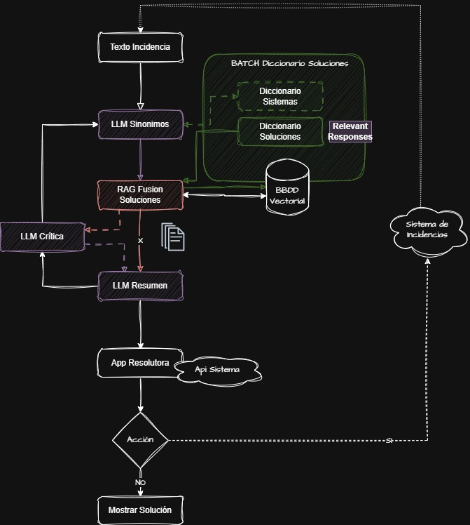

# LLM - Final
### LLM y proyecto final - Proyecto para el Bootcamp
Este proyecto es un entregable para la práctica del Master Bootcamp Inteligencia Artificial Full Stack Edición III realizado por el centro de formación [@Keepcoding](https://github.com/KeepCoding)

---
# Sistema de Gestión Automática de Incidencias

Este proyecto implementa un sistema de gestión automática de incidencias utilizando técnicas avanzadas de procesamiento de lenguaje natural y bases de datos vectoriales. El sistema analiza incidencias de soporte técnico, las reestructura y busca soluciones similares en una base de datos vectorial para proporcionar resoluciones automáticas.

## Diagrama de Flujo

El flujo del sistema se puede visualizar en el siguiente diagrama:


## Estructura del Proyecto

El proyecto está dividido en varios componentes:

1. **MockGestorIncidencias**: Servicio mock que simula un gestor de incidencias existente, proporcionando una API REST para gestionar incidencias.
2. **MockSistema**: Servicio mock que simula el sistema principal al que se le da mantenimiento.
3. **BaseDeDatosVectorial**: Base de datos vectorial (Qdrant) para almacenar y consultar información relevante de incidencias y sus soluciones.
4. **SistemaPrincipal**: Sistema principal que implementa la lógica de resolución automática de incidencias utilizando LLMs.

## Características Principales

- Procesamiento de incidencias usando LLMs (Ollama en DESA, GPT-4 en producción)
- Base de datos vectorial para búsqueda semántica de soluciones
- Sistema de reestructuración de incidencias para mejor comprensión
- API REST para gestión de incidencias
- Integración con sistemas existentes mediante mocks

## Requisitos

- Docker y Docker Compose
- Python 3.8+
- Node.js 16+
- Ollama (para entorno DESA)
- Qdrant (base de datos vectorial)

## Configuración

1. Clonar el repositorio
2. Configurar las variables de entorno en el archivo `.env`:
   ```
   ENTORNO=DESA
   ETIQUETA=[SPAI]
   OPENAI_API_KEY=your_api_key
   MOCK_GESTOR_URL=http://localhost:3000
   MOCK_SISTEMA_URL=http://localhost:3001
   VECTOR_DB_URL=http://localhost:6333
   OLLAMA_BASE_URL=http://localhost:11434
   ```
3. Instalar dependencias:
   ```bash
   pip install -r requirements.txt
   ```
4. Iniciar los servicios:
   ```bash
   docker-compose up -d
   ```

## Uso

1. Ejecutar el proceso batch para preparar la base de datos vectorial:
   ```bash
   python batch.py
   ```

2. Ejecutar el sistema principal:
   ```bash
   python main.py
   ```

## Estructura de Carpetas

```
.
├── api/                    # Funciones para llamadas API
│   ├── gestor_incidencias.py  # API del gestor de incidencias
│   └── sistema.py            # API del sistema principal
├── llm/                    # Definiciones de LLMs y embeddings
│   ├── LLMRephrase.py      # LLM para reestructurar incidencias
│   └── LLMQuery.py         # LLM para consultas a la base vectorial
├── prompts/               # Prompts para los LLMs
│   ├── rephrase_incidence.txt  # Prompt para reestructurar incidencias
│   └── query_vector_db.txt     # Prompt para consultas vectoriales
├── resources/             # Recursos del sistema
│   ├── PROBLEMAS_GLOBALES.csv  # Base de datos de problemas
│   └── solucionIA.jpg         # Diagrama de flujo del sistema
├── mock-gestor-incidencias/ # Servicio mock de incidencias
├── mock-sistema/          # Servicio mock del sistema
├── main.py               # Servicio principal
├── resolution.py         # Servicio de resolución
├── batch.py             # Servicio de preparación de datos
├── requirements.txt     # Dependencias de Python
└── docker-compose.yml   # Configuración de Docker
```

## Variables de Entorno

El sistema utiliza las siguientes variables de entorno:

- `ENTORNO`: Define el entorno de ejecución (DESA/PROD)
- `ETIQUETA`: Etiqueta para identificar las incidencias
- `OPENAI_API_KEY`: API key para OpenAI (entorno PROD)
- `MOCK_GESTOR_URL`: URL del servicio mock de incidencias
- `MOCK_SISTEMA_URL`: URL del servicio mock del sistema
- `VECTOR_DB_URL`: URL de la base de datos vectorial
- `OLLAMA_BASE_URL`: URL del servicio Ollama (entorno DESA)

## Licencia

Este proyecto está bajo la Licencia MIT.
